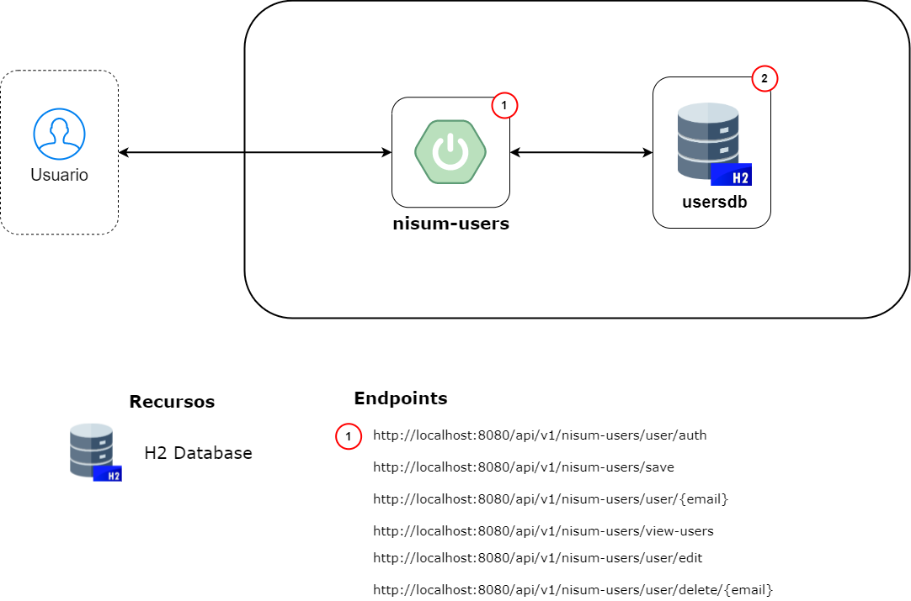

**NISUM-USERS**

-red?logo=java)


#### Tabla de contenido

- [Descripción de la necesidad](#descripción-de-la-necesidad)
- [Diagrama de arquitectura de la solución](#diagrama-de-arquitectura-de-la-solución)
- [Manual de despliegue](#manual-de-despliegue)
- [Ejemplos de JSON para Request y Response](#ejemplos-de-json-para-request-y-response)

#### Descripción de la necesidad

**¿Qué?** Desarrollar una aplicación que exponga una API RESTful de creación de usuarios.</br>

#### *Criterios de aceptación*

- Todos los endpoints deben aceptar y retornar solamente JSON, inclusive para los mensajes de error.
- Todos los mensajes deben seguir el formato:
``` json
{"mensaje": "mensaje de error"}
```

**Registro**

- Ese endpoint deberá recibir un usuario con los campos "nombre", "correo", "contraseña", más un listado de objetos "teléfono", respetando el siguiente formato:
``` json
{
	"name":"Juan Rodriguez",
	"email":"juan@rodriguez.org",
	"password":"hunter2",
	"phones":[
		{
			"number":"3104203522",
			"cityCode":"1",
			"countryCode":"57"
		}
	]
}
```

- Responder el código de status HTTP adecuado.
- En caso de éxito, retornar el usuario y los siguientes campos:
  - **id:** id del usuario (del banco de datos o un UUID).
  - **created:** fecha de creación del usuario.
  - **modified:** fecha de la última actualización de usuario.
  - **last_login:** fecha del último ingreso (en caso de ser un nuevo usuario, va a coincidir con la fecha de creación).
  - **token:** token de acceso de la API (puede ser UUID o JWT).
  - **isActive:** indica si el usuario sigue habilitado dentro del sistema.
- En caso de que el correo se encuentre registrado en la base de datos, deberá retornar un mensaje de error "El correo ya se encuentra registrado".
- El correo debe seguir una expresión regular para validar que el formato sea el correcto (aaaaaaa@dominio.cl).
- La clave debe seguir una expresión regular para validar que el formato sea el correcto. (El valor de la expresión regular debe ser configurable)
- El token deberá ser persistido junto con el usuario.

#### Diagrama de arquitectura de la solución



#### Manual de despliegue

#### *Prerrequisitos*

- [x] Verificar el repositorio y políticas de acceso

| Nombre      | Ruta                                      | Rama   |
|-------------|-------------------------------------------|--------|
| nisum-users | <https://github.com/cy-perez/nisum-users> | Master |

- [x] Contar con el JDK y JRE debidamente instalados en el sistema y configurados en las variables de entorno correctamente:
  - Ejemplo:
    - **JDK:**
      - **Variable name:** JAVA_HOME
      - **Variable value:** C:\Users\cristhian\.jdks\temurin-17.0.8
    - **JRE:**
      - **Variable name:** JRE_HOME
      - **Variable value:** C:\Program Files\Java\jre1.8.0_341\bin

- [x] Contar con un Entorno de Desarrollo Integrado (IDE), por ejemplo, IntelliJ IDEA.
- [x] Tener instalada la aplicación Postman.

### Ejecución del servicio:
- [x] Clonar o descargar el proyecto desde el repositorio.
- [x] Ejecutar el servicio con las configuraciones correspondientes al JDK de Java 17, por ejemplo, temurin-17.0.8.
  - Al ejecutarse la aplicación, se generan las tablas de **nisum_users** y **users_phones** a partir de las anotaciones de jakarta.persistence existentes en las entidades UserData y PhoneData.
  - Igualmente, posterior a la creación de las tablas en mención, se realiza la inserción de algunos datos relacionados en el script **import.sql** de los recursos de la aplicación.
- [x] Importar la colección de Postman existente en los recursos de la aplicación (applications/app-service/src/main/resources/nisum_users_postman_collection.json).
- [x] Crear en las environments globales de Postman una denominada token, cuyo valor actual debe ser el token que arroja la operación GetUserAuth de la colección de Postman.
- [x] Para cada operación existente en la colección (CreateUser, GetUserByEmail, GetAllUsers, UpdateUser y DeleteUserByEmail), se debe asociar la Authentication como Bearer token y debe llevar como valor el token de la variable global descrita en el punto anterior. 
- [x] La documentación del servicio generada por Swagger puede ser visualizada en la ruta <http://localhost:8080/doc/swagger-ui/index.html>.
- [x] El seguimiento a los cambios en la base de datos pueden ser visualizados en la ruta <http://localhost:8080/h2-console>.
  - Datos de conexión:
      - **Driver Class:** org.h2.Driver
      - **JDBC URL:** jdbc:h2:mem:usersdb
      - **User Name:** admin
      - **Password:** root

#### Ejemplos de JSON para request y response

- Ejemplo de JSON enviado para la creación de un usuario

``` json
{
	"name":"Miguel Correa",
	"email":"miguel@correa.org",
	"password":"Hunter123",
	"phones":[
		{
			"number":"3103254854",
			"cityCode":"1",
			"countryCode":"30"
		},
		{
			"number":"3115874521",
			"cityCode":"2",
			"countryCode":"57"
		},
		{
			"number":"3123256454",
			"cityCode":"3",
			"countryCode":"33"
		}
	]
}
```

- Ejemplo de response para la creación del usuario

``` json
{
    "transactionId": "1be04f93-adc7-4821-bc54-2d48c7a759f4",
    "code": 201,
    "message": "Creacion exitosa",
    "data": {
        "name": "Miguel Correa",
        "email": "miguel@correa.org",
        "phones": [
            {
                "number": "3103254854",
                "cityCode": "1",
                "countryCode": "30"
            },
            {
                "number": "3115874521",
                "cityCode": "2",
                "countryCode": "57"
            },
            {
                "number": "3123256454",
                "cityCode": "3",
                "countryCode": "33"
            }
        ],
        "created": "2023-09-18T14:46:36.121+00:00",
        "modified": "2023-09-18T14:46:36.121+00:00",
        "lastLogin": "2023-09-18T14:46:36.121+00:00",
        "isActive": true
    }
}
```
